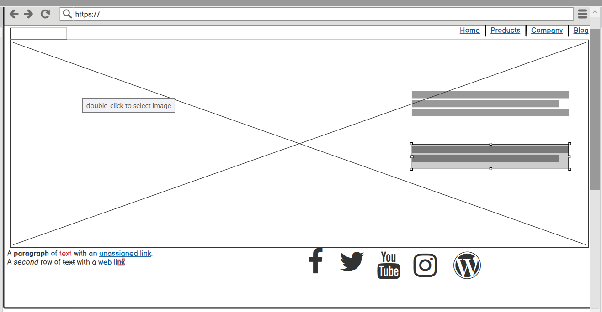
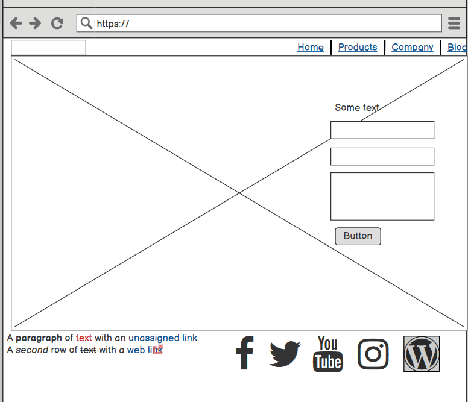
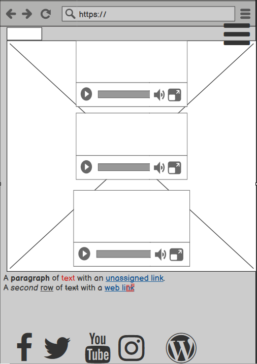

# niallon Band Webpage
----------

## Idea
---
The main aim of this webpage is to branch out further from social media, where different content can be found in different areas can now 
be found in one convenient place at the touch of a button.
In these uncertain times, bookings/concerts etc are not an option and could generate unnecessary pressure on the band itself, as such this option was
traded off in favour of generating a larger fanbase for the future.

### Motivation
I chose this band specifically as I have been a fan since the beginning. They had no site but plenty of material 
to work from. As I am familiar with the band, I had an idea about who they were, what their style is 
and the personal connection really helped with the design element.

### Future Planning
As previously explained, the current primary focus of this site is to increase their fanbase. 
Due to the pandemic, I found adding a booking page to be redundant as live shows would not be possible 
for the forseeable future, with this in mind content and fan connection became the goal.
For the future, extra pages can be added for testimonials, a form can be added to the contact page specifically 
for bookings and extra media can be added to the "Listen Here" page to show live show previews.
Further down the line depending on success levels, band merchandise could also be added.

## User Experience (UX)
----------

### Wireframes
- Home Page

The Desktop screen was designed to show as much of the banner image as possible therefore,
all content was positioned to the right of the page.

- Contact Page

The same idea applies here, the tablet screen size is just enough to see the full banner 
and so, content was positioned to the right of the screen.

- Listen Here Page

Mobile screens do not allow full image to be displayed but it does feature as the 
background image whilst showcasing the band's videos which are higher in importance and 
so take the centre of the screen.

### User Stories
----
#### First Time Visitor:
- When visiting the site for the first time, I first and foremost want to be able to see/hear the band's material, and access it easily.
- I want to see some information about the band, their history, where they are based, are they available for bookings?
- As a social media user, who spends a great deal of time on these apps, I want to be able to access the bands social media to follow and support
them.

#### Returning Visitor:
- Upon returning to the site, I want to be able to contact the band if I want to book them.
- I want to be able to listen to the bands music and see any promotions or news they have.

#### Frequent Visitor:
- A frequent visitor to the site would want to see regular band updates such as album releases, merchandise or concert promotions.
- It would also be useful to frequent users to be able to access the bands music libraries in one place such as songs, videos or interviews.

---
#### Design
- Imagery  
The banner image for the site is the main focal point for the user, I chose this image as I 
felt it described the bands aesthetic best. The image itself is striking even though it is in black and white and
the different shades and tones make it pleasing to the eye. 

- Colour Scheme  
The colour scheme for this site was matched to the tones and shades in the main banner image. The 
fonts and backgrounds contrast with each other between black, off-white and a steel grey. I chose 
these colours as not only did they tie to the focal point of the page itself but they are also clear and easy to read.
The only other colour that features on this site is a grey-blue to show any links on hover
and it also fits in to the overall colour scheme.

- Typography  
The page has two fonts that serve two different purposes, "East Sea Dokdo", for the nav-brand logo, nav-links and footer headings. I specifically
chose this font as it has an arty, fun feel to it which reflects the band itself.
The "Roboto" font makes up the rest of the site fonts which was chosen as it is a popular font right now 
and will add a familiarity to new users.
Both fonts are backed up by the sans-serif font.

- Continuity  
The page is designed to be completely user-friendly. All of the elements are clear and accessible with added descriptive links 
to guide the user to where they wish to go. All 3 pages on the site follow the same design format as to not overload the user
and cause confusion. Elements are spaced, with clear fonts and to the point with a lot of visual cues 
making the overall user experience to be enjoyable and familiar.

#### Features:
- Responsive across all devices.
- Contains interactive elements to engage the user.
  

## Technologies Used:
---
#### Languages Used:
- HTML5
- CSS3

#### Frameworks, Libraries and Programs Used:
- [Balsamiq](https://balsamiq.com/wireframes/desktop/)- Used to create wireframes that were essential to the site design along with avoiding "Scope Creep".
The wireframes kept a clear and concise map to the site making it easier to not introduce new elements/ design/ or pages without proper planning.
- [Bootstrap 4](https://getbootstrap.com/docs/4.1/getting-started/introduction/)- This framework was used in ensuring all pages were responsive 
across all devices.
- [Google Fonts](https://fonts.google.com/)- Used to choose attractive and familiar fonts used on this site.
- [Font Awesome](https://fontawesome.com/)- Used to add well known icons for links throughout the site,
further adding to the user experience.
- [jQuery](https://code.jquery.com/)- Used as part of the Bootstrap Framework, jQuery was 
used to add a responsive navbar to the mobile screen of the site.
- [Git](https://git-scm.com/)- By using the Gitpod terminal to create,  commit and push changes to GitHub.
- [GitHub](https://github.com/)- Used to store project as a repository and incorporate changes made from Git.

## Testing
---
- All HTML code was validated by [W3C Validator](https://validator.w3.org/) 
- All CSS stylings were validated by [W3C CSS Validator](https://validator.w3.org/) 

### Testing User Stories in regards to User Design (UX) Section:

#### First Time User:
When using the site for the first time, I want to be able to see/hear bands material, their information and their social media
links
- The homepage of the site shows clear visual cues in the navbar to guide the user to the 
bands material, the "Listen Here" page the offers three of the most popular videos by the band 
with an option to hear more along with a direct Youtube Link located on the footer across 
all three pages of the site.
- The homepage introduces a few lines about the band accompanied by the option to sign up for album 
release information.
- All three pages have direct links shown by well known icons to all of the bands social media 
accounts.

#### Returning User:
Upon returning to the site, I want to be able to contact the band if I want to book them, 
be able to listen to the bands music and see any promotions or news they have.

- The homepage of the site offers a Contact Me link located clearly on the navbar which will bring the user to a form 
and explain to them what they need to do, the form cannot be submitted without content in all fields avoiding 
unnecessary traffic for the band and avoids sending an incomplete message for the user. 
- The homepage itself acts as a space for band updates, currently as the band is not taking bookings due 
to the global pandemic, this is clearly indicated and avoids disappointment for a user wishing to book 
in the near future. There is plenty of space to adjust or add new announcements on the page to this area 
and will remain one of the first things a user will see.

#### Frequent User:
A frequent visitor to the site would want to see regular band updates such as album releases, merchandise or concert promotions along will full 
access to the bands music library.
- As explained above, for frequent users, the homepage will act as an announcement page to alert 
frequent visitors of any upcoming news or events.
- They will also have access to the bands full music library via the Listen Here link.

### Further Testing
- The site was tested on Google Chrome, Microsoft Edge and Internet Explorer browsers.
- Testing was performed on a wide range of devices such as Samsung Galaxy/iPhone8 phones, tablet screens and Desktop screens.
- Friends and family memebers were asked to test the site to ensure a full range of screens were reached and that all links performed correctly.

### Known Bugs:
- On the Internet Explorer Browsers, the content on "Contact" is pushed to the far-right and the video content is displayed inline on "Listen Here Page".
- On Suface Duo screen, content is pushed to the right which distorts the flow of the website.
- On mobile view, the modal form stretches outside the modal itself, attempted to resize both normally and in 
media query.

## Deployment:
---
### GitHub Pages
This project was deployed to GitHub Pages by completing the following steps:
1. Log into [GitHub](https://github.com/) and enter login details.
2. Select the repository you wish to deploy and click the settings option located last in the list on the top
left of the screen.
3. Scroll down to GitHub Pages section.
4. Under Source, use dropdown menu showing "none" and select "master".
5. The page will refresh automatically.
6. Again scroll down to Github Pages section and a link will be available to your site.

### Forking the GitHub Repository:
This is done by making a copy of the original repository that can be amended
without changing the original.
1. Log into [GitHub](https://github.com/) and enter login details.
2. Select the repository you wish to fork.
3. The Fork button is located as the last of three options on the top right of the screen.
4. A copy should then be located in your account.

## Credits:
----
### Content:
- All content was written by the developer.

### Code:
- Bootstrap 4 library was used and adapted to suit the needs of the site.
- Code Institute lessons again were used and adapted specifically "Bootstrapping your Next Big Idea" and
"Putting it all Together".

### Media:
- All images, videos and social media links belong to niallon official and were used with their permission.

### Acknowledgements:
- My mentor for his valuable guidance.
- The tutors at Code Institute for their support.

